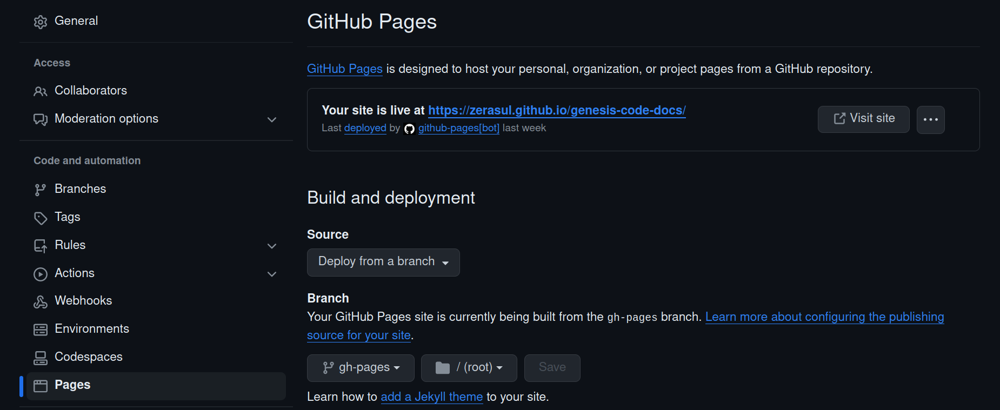

# Activar Github Pages (Opcional)

Ya estamos a sólo un paso de tener nuestra web en Github pages; para ello, vamos a activar la opción de Github Pages.

En algunos casos esta opción se activa automáticamente al utilizar un repositorio para una web personal (con nombre ```nombreusuario.github.io```); pero siempre viene bien poder comprobar estas opciones.

Para poder ver las opciones de Github pages, podemos usar la configuración del repositorio; para ello, accedemos a la dirección de nuestro repositorio en github; es decir:

```https://github.com/nombreusuario/nombreusuario.github.io```

Una vez aquí, pulsaremos en la configuración o pestaña ```settings``` tras ello, nos iremos a la partado ```pages```.

<figure>
    
    <figcaption>Configuración Github Pages</figcaption>
</figure>

Aquí podremos activar/desactivar la página, elegir la rama y varias opciones más.

Una vez revisadas las opciones, nuestra web debería estar publicada en:

[https://nombreusuario.github.io](https://nombreusuario.github.io)