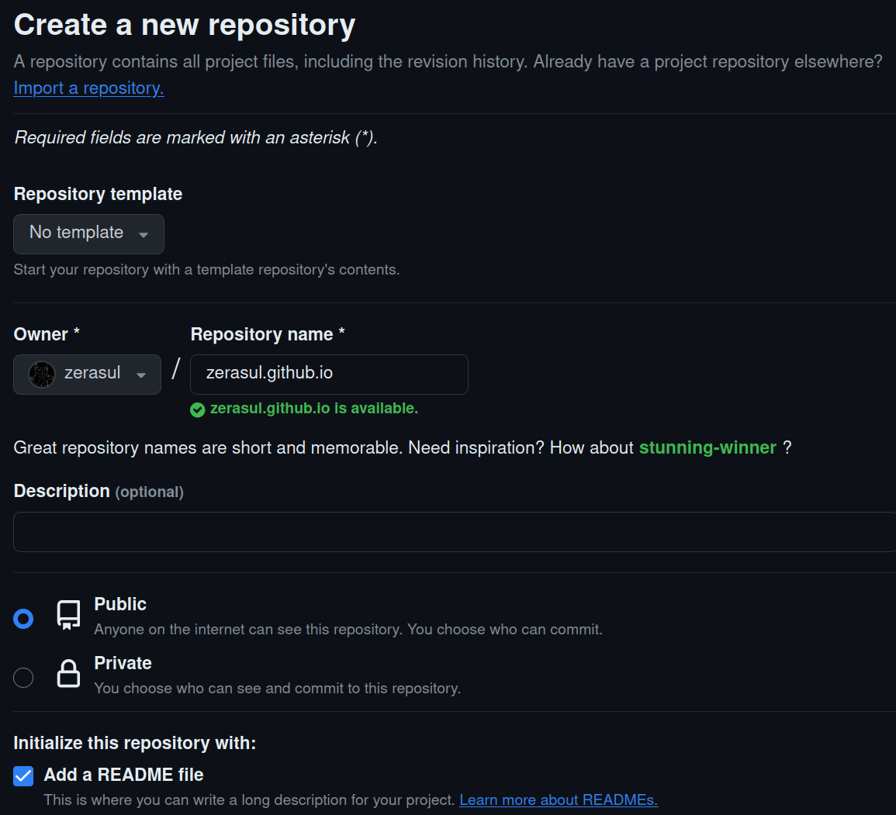
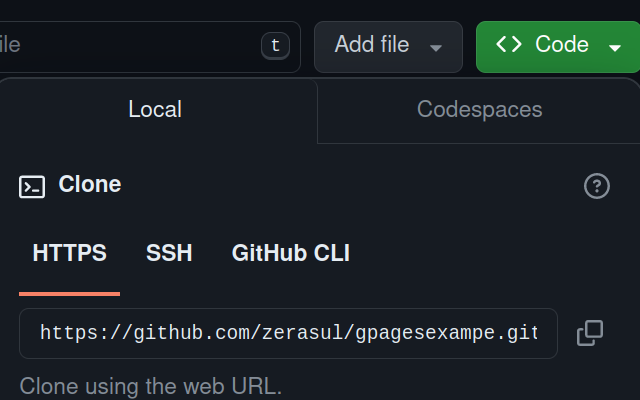

# Repositorio Personal

Una vez que tenemos el documento HTML, podemos pasar a subirlo a Github de tal forma que podamos publicarlo usando Github pages.

Github pages, permite publicar dos tipos de web:

* _Web Personal_: que incluye la información personal de un usuario u organización.
* _Web de Proyecto_: Que incluye la información de un proyecto.

Dependiendo de cada caso, podemos publicar un tipo u otro.

## Web Personal

Comenzaremos con publicar la web personal; en este caso github permite crear una web por usuario o por organización. En Github, una organización puede ser una empresa o fundación tanto pública (Open Source); como privada.

Estas web, estarán bajo el dominio (salvo que se use un dominio personalizado) ```nombreusuario.github.io```; estos dominios son gratuitos.

Para poder tener este dominio, tenemos que crear un repositorio en Github con exactamente el mismo nombre hemos comentado; es decir, ```nombreusuario.github.io```; para ello, seguiremos los siguientes pasos:

1. Conectar a la web de Github: [https://github.com/](https://github.com).
2. Entrar con nuestra cuenta (recuerda el usuario y contraseña).
3. Pulsar en el botón ```+``` que encontraremos en la parte superior derecha; y seleccionar la opción ```New Repository```.
4. En la siguiente página escribir el nombre del repositorio con la siguiente estructura ```<nombreusuario>.github.io```.
5. Rellena la descripción y añade un README.
<figure>
    
    <figcaption>Creación de repositorio</figcaption>
</figure>

Por último pulsa en ```Create Repository``` para crear nuestro repositorio personal.

### Subir ficheros a Github

Una vez creado el repositorio, tenemos que subir los ficheros que necesitamos con el documento HTML y los correspondientes recursos de la web (imágenes, audio,etc...).

**NOTA:** Este apartado es opcional ya que puede utilizarse la web de github para subir los ficheros uno a uno.

Para ello, vamos a utilizar la herramienta Git. Git, es una herramienta de control de versiones que podemos utilizar para trabajar con github.

Esta herramienta de control de versiones, nos va a permitir tener un control de las distintas versiones del documento para poder tener un mejor control de este y no perder información.

En primer lugar, vamos a descargarnos el repositorio de github, usando los siguientes comandos (recuerda que debes tener instalado git en tu sistema; que puedes encontrar en este [enlace](https://git-scm.com)). El siguiente comando descargará el readme que hay en github:

```bash
git clone <url de nuestro repositorio>
```

La URL de nuestro repositorio, podrás encontrarla en la web de github, pulsando en el botón ```code``` y copiando la dirección de HTTPS.

<figure>
    
    <figcaption>URL de nuestro repositorio</figcaption>
</figure>

Una vez el repositorio ha sido clonado, copiaremos el documento HTML y los correspondientes ficheros en la carpeta creada.

```bash
git add .
git commit -m "subiendo HTML"
git push origin main
```

**NOTA**: Puede que de un error a la hora de tratar de realizar el comando ```commit```; esto es por que se requiere configurar el usuario y mail con los siguientes comandos:

```bash
git config --global user.name "nombreusuario"
git config --global user.email "email@email.com"
```

Una vez hemos realizado este apartado, ya solo nos queda activar github pages.

Si necsitas más información acerca de Git y GIthub, dejamos un vídeo con un tutorial completo:

<iframe width="560" height="315" src="https://www.youtube.com/embed/z1CpO1F78V4?si=k8Ao-_Vr_5PaeRg7" title="YouTube video player" frameborder="0" allow="accelerometer; autoplay; clipboard-write; encrypted-media; gyroscope; picture-in-picture; web-share" allowfullscreen></iframe>
<p></p>
