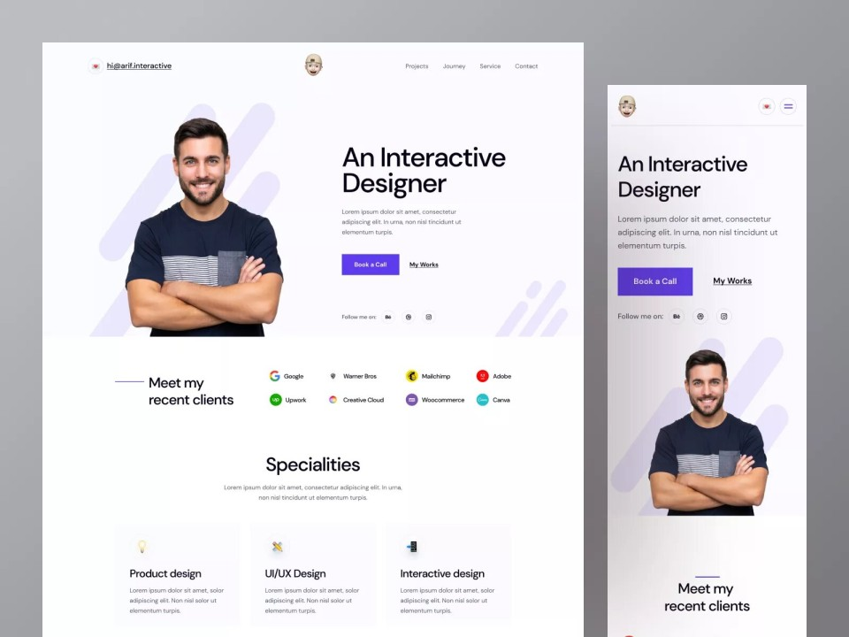

# Mi Web Personal

Vamos a pensar en un caso práctico; como profesionales que podemos a llegar a ser del sector, necesitaremos tener una web para poder no solo presentarnos; sino también para poner en un futuro algún blog o incluso un portfolio con algunos de nuestros proyectos.

<figure>
    
    <figcaption>Portfolio Web (Fuente: <a href="https://www.figma.com/community/file/1144519064091466465/personal-portfolio-website">Figma</a>)</figcaption>
</figure>

Es por ello, que necesitaremos publicar un documento HTML, para poder tener toda esta información publicada en la web. Por supuesto utilizando los lenguajes de marcas y las distintas herramientas que disponemos.

Algunas de estas herramientas, las hemos visto en clase y otras, vamos a verlas paso a paso para que cualquiera pueda seguir este recurso para resolver este caso práctico.

## Creación de un documento HTML5

Vamos a crear un documento HTML, que contenga toda la información necesaria para nuestra web personal. Es importante mencionar que vamos a trabajar bajo el estándar HTML5.

HTML5 es el estándar para crear documentos basados en HTML _(HyperText Markup Language)_; que es mantenido por la W3C (World Wide Web Consortium).

En nuestra web, vamos a necesitar añadir información no solo en forma de texto; sino también imágenes e incluso vídeos o audio. Por lo que necesitaremos guardar toda la información requerida.

Por supuesto, para realizar esta práctica, necesitarás un editor de texto como [Visual Studio Code](https://code.visualstudio.com/); aunque puedes usar el que más te guste.

Sin más, vamos a crear la base de nuestro documento HTML; para ello crea un fichero de texto y llamalo ```index.html```; este será nuestro fichero principal.

Comenzaremos creando el esquema inicial de un documento HTML:

```html
<!DOCTYPE html>
<html lang="en">
<head>
    <meta charset="UTF-8">
    <meta name="viewport" content="width=device-width, initial-scale=1.0">
    <title>Mi p&aacute;gina</title>
</head>
<body>
    
</body>
</html>
```

Este será por donde comenzaremos a realizar nuestra web. Vamos a crear nuestra web personal utilizando tanto las etiquetas básicas de HTML, como las etiquetas semánticas propias de HTMl5.

Nuestra web debe tener los siguientes apartados:

* Una cabecera con nuestro nombre.
* un menú con los siguientes apartados:
    * _Inicio_: Que apuntará al inicio.
    * _Intereses_: Que apuntará al apartado de intereses.
    * _Portfolio_: Que apuntará al apartado de portfolio.
* Un apartado principal con 3 secciones:
    * _Inicio_: que contendrá una foto nuestra y una descripción.
    * _Intereses_: que contendrá una lista desordenada con nuestros intereses.
    * _Portfolio_: Que contendrá enlaces de interes o algunos proyectos que puedan interesarnos en caso de que no tengamos ninguno.
* Un footer con un disclaimer incluyendo el copyrigth y año.

Puedes encontrar información sobre como crear el documento en los apuntes vistos en clase o en la web [W3cSchools](https://www.w3schools.com/).

